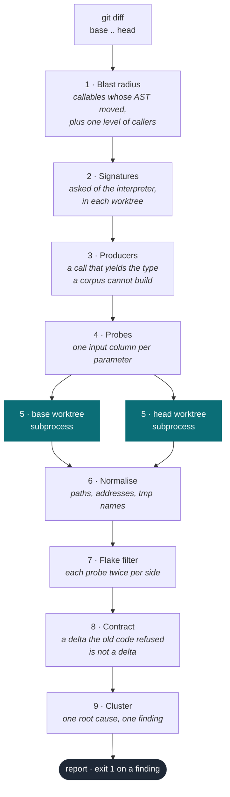

# twinrun

Run the old and the new version of changed code on identical inputs, and report
where the outputs differ.

<br clear="left">

The old code is the oracle. You don't write a specification, you don't write
assertions, and there is nothing to configure — if the behaviour of something
changed and you didn't mean it to, twinrun shows you the exact call that proves it.

```
$ twinrun . --base main --head HEAD
twinrun main..HEAD

  DELTA  billing/cart.py :: Cart.total   +7 more calls
         Cart(0).total()
         base  return       int        0
         head  return       float      0.0

  DELTA  billing/cart.py :: Cart.add     +21 more calls
         Cart(0).add(1)
         base  return       NoneType   None
               after  self=[('items', [1]), ('rate', 0)]
         head  return       NoneType   None
               after  self=[('items', [2]), ('rate', 0)]

2 findings from 30 calls · 6 callables checked · 72 probes (54 reached the change) · 8 flaky dropped
```

Exits 1 when there is a finding, 2 on a usage error, so it drops into CI as-is.

| Reach for it when | It will not help when |
|---|---|
| A refactor claims to change nothing, and you want that claim checked | The change only shows up through thread or I/O ordering — twinrun compares outputs, not schedules |
| An agent wrote the change: it knows what it meant to touch and nothing about what else moved | The callable cannot run without a live database or service |
| The code is importable and the test suite already constructs the objects it needs | Nothing names the types — an unannotated private method nothing calls has nothing to build from |
| You want the diff's *behavioural* consequence, not an opinion about the diff | The repository is not Python |

When the change was the point, `--accept` records it, and the calls it recorded
become invariants that later commits are checked against.

## Install

```
make install        # pip install -e .
```

Or run it out of a checkout without installing anything:

```
python3 -m twinrun . --base main --head HEAD
```

No dependencies. Python 3.10+.

## Use

```
make all                                  # self-check, then twinrun on its own last commit
make demo REPO=~/work/api BASE=main HEAD=my-branch
twinrun ~/work/api --base main --head my-branch
```

| flag | default | meaning |
|---|---|---|
| `--base` | `HEAD~1` | revision treated as the oracle |
| `--head` | `HEAD` | revision under test |
| `--limit` | `24` | max probes per callable |
| `--timeout` | `20` | seconds per side, per callable |
| `--seed` | `0` | probe sampling seed |
| `--repeats` | `2` | runs per side used to detect non-determinism |
| `--accept` | | record the current findings as intended, in `.twinrun.json`, and keep the calls as invariants |
| `--note` | | a line stored alongside what `--accept` records |
| `--llm` | off | when nothing can be built, or nothing reaches the change, ask a model for an input |

CI runs the self-check on 3.10/3.12/3.13, and on every pull request twinrun
verifies that pull request against its own base branch.

In someone else's repository that is one step. The action checks out the base
revision itself, since a shallow clone does not have it, and writes the report
to the job summary:

```yaml
- uses: actions/checkout@v4
  with: {fetch-depth: 0}
- uses: prian3003/twinrun@main
```

It fails the job on a finding, which is the point of putting it there. A team
that wants the report without the gate sets `fail-on-finding: false`; a usage
error still fails either way. The number of findings comes back as the
`findings` output, and `base`, `head`, `limit` and `timeout` take the flags of
the same name.

The other place it belongs is next to whatever wrote the change. An agent
finishing an edit has the reviewer's problem and less to go on: it knows what
it meant to change and nothing about what else moved. `twinrun-mcp` is the same
verify behind an MCP tool, so it can ask.

```json
"mcpServers": {"twinrun": {"command": "twinrun-mcp"}}
```

It speaks the protocol on stdin and stdout with no package behind it, for the
reason the rest of the tool has none: twinrun imports the code it is measuring,
and a dependency it carries is one that can collide with the repository under
test. One tool is exposed, `verify`, returning the report a person reads and
the same answer as data. `--accept` is deliberately not exposed. A verdict is a
person saying a change was meant, and an agent blessing its own findings would
write the regression down as the answer.

## How it works



The old code runs in one worktree, the new code in the other, on byte-identical
inputs. Everything between step 6 and step 9 exists to throw away differences
that are not the commit's fault.

1. **Blast radius** — diff the two revisions, parse both sides, keep the callables
   whose AST actually changed, plus one level of their callers in the same file.
   Extracting a helper leaves its callers byte-identical while their behaviour
   moves underneath them, and the caller is the name anyone actually calls. A
   caller is a guess, so it is asked to reach any line the commit moved in that
   file rather than one of its own, and a guess that reaches none of them is
   dropped instead of reported: the commit never touched it.
   Comments, formatting, docstrings, annotations and parameter names never reach
   step 2. Each of them is a node, so editing one makes the AST differ, and none
   of them is something an output comparison can see. Dropping them removes four commits
   from the itsdangerous sweep below entirely, one of which was spending 264
   probes on a docs split, and cuts the "no probe reached" skips by more than
   half: most of what could not reach the change was a callable with nothing
   executable changed in it.
   Annotations are dropped from parameters and return types only: the one on a
   class-level assignment stays, because a dataclass field annotation is not a
   comment on the behaviour, it is the behaviour. Parameter names go into
   positional slots, signature and body together, because a twin run only ever
   calls positionally — renaming by position rather than by identity is what
   makes that safe, since `f(a, b) -> a` and `f(b, a) -> b` really do return the
   same thing for `f(1, 2)`. Four of the sweep's seven "signature changed"
   skips turned out to be renames.
2. **Signatures** — ask the interpreter, in each worktree, what the target and its
   constructor actually take. The parse tree cannot see a constructor inherited
   from a base class in another module, cannot expand a type alias, and cannot
   resolve a string annotation; all three are ordinary in real code.
3. **Producers** — a corpus of edge values cannot build a signed token or a parsed
   config, but the module that consumes one usually contains the function that
   makes one. Module functions and instance methods are
   called to fill parameters of their type, including from the sibling modules
   this file imports from -- `timed.py` takes what `signer.py` signs. Type
   aliases are expanded, an inherited `__init__` is resolved to the base class
   that defines it, and the repository's own tests are read for inputs: nobody's
   edge-value corpus produces a validly signed payload or guesses a separator a
   constructor will accept, and the test suite has both. Long string and bytes
   literals are taken as values, and a call whose arguments are all literals is
   taken as a construction -- `Signer("secret-key")`, or the same thing written
   as a `partial` in a pytest fixture. Two literals rank ahead of the producers
   and the rest behind, so the input someone wrote down competes with the input
   a round trip builds instead of always losing to it. The literals are ranked
   among themselves first, because a suite's long strings are a mix of two things
   and only one of them is an input: `'[42].-9cNi0CxsSB3hZPNCe9a2eEs1ZM'` is a
   payload, a separator and a digest, while `'not supported'` is prose quoted
   from an assertion about an error message. Whitespace says prose, a separator
   says structure.

   Producers are read from the base revision only. A function that exists solely
   in head would raise `NameError` on one side and return a value on the other,
   which is a delta on every callable that consumes its type. Then each one is
   called once, in the base worktree, and what it made is pasted back into the
   probes as a literal. That is what makes a round trip survive its own commit:
   a producer is code, and code the commit touched hands the two sides different
   inputs, so the commit that changes `dumps` used to be exactly the commit that
   left `loads` with nothing but a corpus string and `No b'.' found in value`.
   Frozen, it stops being code -- both sides get the same bytes, and the bytes
   are the ones the old revision issued, which is the contract the whole tool
   rests on. It settles the clocks on the way past: a producer that stamps a
   timestamp used to sign a fresh token per side and disagree about nothing.
   Anything that will not freeze into a literal -- an instance, an open file --
   keeps its call expression, and that is only allowed for a producer the commit
   left alone.

   The same call is where an unannotated producer gets its type. Nothing in the
   source says what `def dumps(self, obj, salt=None)` makes, which is most of a
   codebase written before anyone typed it, so it files itself under whatever it
   turned out to return -- behind everything the annotations offered, because a
   declared type is a claim about every call and this is a fact about one. The
   two are matched on meaning rather than spelling: `_t.Union[str, bytes]` off
   the parse tree and `str | bytes` out of the interpreter are one type written
   twice, and as strings they never met.
4. **Probes** — build inputs from each parameter's type, using a small
   corpus of edge values (`0`, `-1`, `2**31`, `''`, `float('nan')`, `[]`, …). For a
   method, the constructor's parameters are probed in the same sweep, so the
   instance is part of the input.

   An annotation names several things and only one of them is the type. The
   search takes the first name the corpus models, reading a container ahead of
   its element type — `Iterable[V]` is a list, not a TypeVar to call — and
   ignoring the `None` of an optional, which is a second value the parameter
   accepts and not an answer to what it is.

   A container whose element type the corpus does model is filled from that
   type, the test suite's own literals first: `Sequence[str]` out of the list
   corpus is `['a', 'b']`, which click's `Option` refuses before its own body
   starts, and `['--normal-flag1']` builds. `Iterable[Any]` says no more than
   `Iterable` does and keeps the container's corpus, as does `Iterable[V]`.

   An annotation nothing models still says whether `None` is allowed, and that
   is not a guess. click's `type: ParamType | Any | None` took the untyped
   spread and raised on `__name__` every probe, while `None` is what every real
   call passes.

   A construction harvested from the tests replaces that sweep when there is one:
   a constructor with six parameters spends six probe columns getting itself
   built, and one the test suite already wrote spends one and is known to work.
   Any commit that touches an `__init__` gives them up, since `__init__` resolves
   through inheritance and the one that moved is not always the one named.

   An unannotated parameter gets the producers and the fixtures too, not just
   the spread. A codebase with no type hints is exactly the one where the
   harvest is all there is, and the value that gets past a signature check is
   the token the test suite wrote down, never `0`.

   A change behind `if version == 0x8f` is not something an edge-value corpus
   guesses, so the constant is read off the branch that encloses the moved lines
   and put at the front of that parameter's column, where the first probe picks
   up every column's front at once — which is what a guard reading `a == 1 and
   b == 2` needs. Only `==` and `in` are mined, against a parameter or a `self`
   attribute; a `<` names a direction rather than a value, and the corpus
   already carries both ends of the range.

   A branch that tests for truth instead of comparing names no constant at all,
   and what `if self.resolve_path:` earns is the column rather than what goes
   in it. A constructor's optional parameters are otherwise left at their
   defaults, because inventing values for them mostly fails to build anything
   at all; one the target's own guards name is the exception, and the list is
   taken back as far as that parameter, since a positional call cannot skip the
   ones in front of it. click's `Path.convert` moved four lines, each behind an
   `if self.resolve_path` or an `if not self.file_okay`, and the receiver was
   built with the default that never runs any of them. Naming a value here
   would be redundant, and briefly was worse: every modelled type already
   carries a falsy value beside a truthy one, `''` beside `'a'` and `0` beside
   `1`, while a literal `True` at the head of a column annotated `str` fails on
   the first line the branch was guarding.

   The literals written on the changed lines go in as well, from both revisions,
   since a commit that removes a line leaves the literal it operated on only in
   base. A guard mines the constant a branch demands; this mines the constant
   the changed code works on, which is the other half — click's revert dropped
   the colon escaping from `item.value.replace(":", r"\:")`, and no corpus of
   edge values holds a string with a colon in it, so both revisions agreed on
   every probe that ran. Short ones first: a separator is the sort of thing a
   value has to contain for the moved line to do anything, and a sentence quoted
   from an error message is not. They reach a nested constructor's parameters
   too, which is where a project type keeps its strings, and an `Any` gets them
   as well — it says nothing about the type, so it has no claim to refuse them.
   One synthesised construction per hint puts that literal in every parameter
   that takes it, because the columns are different lengths and the diagonal
   otherwise pairs a colon in the value with an empty help, which is the one
   combination the zsh formatter treats the same way in both revisions.

   `Any` says nothing on its own, but `dict[str, Any]` and `IO[Any]` say plenty:
   the type argument is not the type. Reading the whole annotation as untyped is
   how a file parameter ends up probed with `0`, raising `'int' object has no
   attribute 'read'` on the first line of every probe, so `Any` only decides the
   answer when nothing modelled is left underneath it.

   Every value in every column is covered before anything is sampled, with the
   columns advancing together, because a change that only shows up when two
   parameters are both interesting is invisible to a sweep that holds one of
   them at zero. What budget is left after that goes one factor at a time —
   vary one column, hold the others at their first value — since advancing them
   together also pairs a signed token with a garbage max age, and the call dies
   before the signature is ever checked.

   A parameter annotated with one of your own classes gets a real instance built
   for it, by probing that class's `__init__` two levels deep: a constructor that
   itself wants a project type gets one built rather than a no-argument call.
   One level is enough for a library of leaf types and not enough for a
   framework — click's `Context` takes a `Command`, and at one level every probe
   that needed a `Context` died in setup. Anything else that
   is a bare name — an imported type, something it has never heard of — is tried
   as a no-argument constructor, resolved in the target module's own namespace.
   When that cannot be built the failure is identical on both sides, so a type it
   cannot model costs a probe and reports nothing. If nothing usable could be
   built at all, the callable is listed as skipped rather than counted as checked.
5. **Twin run** — check out both revisions as git worktrees and call the target in
   a subprocess on each side with the same inputs. Return value, type, exception,
   stdout, argument mutation and instance state are all recorded. A method that
   returns `None` and quietly changes `self` is the common case, not an edge case.
   The instance is compared for what the call changed, not for what it held on
   arrival, the same way the argument list is: a constructor that renames an
   attribute otherwise reports itself once per method on the class, on methods
   that each return exactly what they always did, and never at the line it
   happened on.

   A constructor gets a probe of its own instead. It returns nothing, so the
   instance it left behind is the answer, and its class's methods come along as
   callers -- what the constructor became is one half of the question and what
   that costs the methods is the other. No method body names `__init__`, so
   nothing finds them by reference; they have to be taken by class. The trace
   goes with them: a constructor runs entirely while the probe is being set up,
   and a trace that starts at the call sees none of it.

   A line trace scoped to the target file records which probes executed a line
   the commit actually moved, because calling a changed callable is not the same
   as reaching the change inside it. A callable is asked for its own moved lines
   and nobody else's: the hunk names lines in a file, probing a method builds
   the instance first, and a commit that touches `__init__` alongside a method
   had every method on the class reporting coverage of an edit its own body
   never ran. Across the 53 non-merge itsdangerous commits since 2019 that
   touch the package — 29 of which leave anything executable to run — 3549 of
   4987 probes reach it; the rest run the function around the edit. A callable
   that nothing reached and that produced no delta is reported as skipped
   rather than counted as checked: 12 of the 39 skips on that sweep, against
   202 callables checked. A delta overrides the reach test: a moved
   default argument or class attribute is evaluated at import, before the trace
   starts, and differs anyway.
6. **Normalise** — the two revisions are checked out at different paths, so
   anything that surfaces its own location (a cwd, a `__file__`, a path inside an
   error message) would differ for a reason that has nothing to do with the
   change. Both checkout roots collapse to `<repo>` before anything is compared,
   and the address inside a default `repr` collapses with them — left in, it makes
   every object-valued result look non-deterministic. The random half of a
   temporary file's name goes the same way: a function that makes one answers
   differently on every run, so its probe was dropped as flaky, and where two
   runs on one side happened to agree it reported a difference that was only the
   name. What the code put underneath the temporary directory survives.

   A line number is collapsed for the same reason. A warning or a traceback
   names the line it came from, and any commit that moves code moves that
   number: one `RuntimeWarning` about one call, reported as a difference
   because base said `types.py:744` and head said `types.py:773`. Only a number
   attached to a path this repository owns is collapsed; one the code printed
   itself is still the answer.
7. **Flake filter** — every probe runs twice per side. If a side disagrees with
   itself the probe is non-deterministic, and it is dropped rather than reported.
   Clocks, RNG, hash ordering and network calls come out here.

   The runs interleave the two sides rather than finishing one side and then the
   other, which is what lets the filter see wall-clock drift. A producer that
   embeds a timestamp gives the same answer twice in a row and a different one a
   second later, so back-to-back base runs agree with each other, head's agree
   with each other, and the two sides differ for a reason that has nothing to do
   with the commit. Interleaved, both sides straddle the same window and the
   drift surfaces as a side disagreeing with itself. Two runs of the itsdangerous
   sweep now report the same 19 findings; before, the count moved between runs.

   Two runs catch noise with a wide range of outcomes. A target that returns one
   of only a handful of values can still agree with itself by chance — roughly a
   one-in-six coin flip stays quiet about 17% of the time — so raise `--repeats`
   when you are verifying something like that.
8. **Contract** — a delta the old code refused is not a delta. If the base
   revision answered a probe with `TypeError` or `AttributeError`, that call was
   never valid and nothing depended on what it did, so whatever the new revision
   makes of it is not a regression. jinja's `pyupgrade` commit reported 19
   findings on the strength of `TemplateSyntaxError(msg, lineno='a')`: the base
   raised `%d format: a real number is required` and the f-string that replaced
   it formatted the string happily. True, and useless. With the rule in place
   that commit checks 63 callables and reports nothing. The count is printed, so
   a run that drops a lot of probes says so.

9. **Cluster** — one root cause is one finding. Thirty calls that all differ
   `int → float` are reported once, with a count.


## Intended changes

Most commits change behaviour on purpose. The old code is the oracle for what
the behaviour *was*; only a person can say whether changing it was the point,
and a check that reports the same intended change on every run is one people
turn off.

```
twinrun . --base main --head HEAD --accept --note "rounding is now banker's"
```

That writes each current finding to `.twinrun.json` under a fingerprint of
where it happened and what changed about the answer — never the arguments,
which differ with the seed and the budget, so a finding recorded once is
recognised again. Later runs set those aside and say how many, and the file is
meant to be committed: it is a record of decisions, and it reviews like one.

A verdict is scoped to the shape of the difference, not to a revision. If the
same callable changes again in a new way, the fingerprint is new and the
finding is reported.

### What a verdict is worth after the commit it was given on

Saying a difference is intended does two things, and the second one outlives
the first. It says stop reporting this, and it says what the behaviour is now
supposed to be. So accepting a finding also writes down the calls that exposed
it and the answers they gave, and every later run replays them against head
before it reports anything.

That is the half the blast radius cannot do. The radius is what makes this
cheap -- probe what the commit touched and one level of callers in the same
file, never the whole suite -- and it is also the hole: a callable the next
commit does not touch is a callable the next run never probes. A stored answer
does not care what the diff touched. In the self-check a commit changes
`scale` in one file, `total` in another file is not in the radius and is not
probed, and the stored answer is the only thing left that knows `total(1)` was
agreed at 4:

```
  BROKE  api.py :: total   +3 more calls
         total(1)
         agreed  return       int        4
         now     return       int        5
```

There is no base side because there is nothing to compare against: the stored
answer is the oracle, which is the whole point of having kept it. Every call in
the finding is kept, not just the one the report printed -- `total(0)` came
through the same regression unharmed, because zero is a fixed point of
doubling and of tripling, and one example is a thin thing to hold code to. A
call that disagrees with itself is dropped the way any other flaky probe is,
and a callable that has been renamed or deleted is not a regression, so it is
passed over rather than reported.

### Asking for an input twinrun cannot build

Every value it probes with comes from an annotation, a guard literal, or a
construction lifted out of the test suite, and on click that leaves 493
callables unprobed: 184 where nothing could be built at all, and 309 where
something was built and no probe ran a line the commit moved. Both are one
failure -- a type the corpus does not model, or a value too specific to guess
-- and it is the largest single thing standing between the tool and the rest of
a repository.

`--llm` asks for those inputs, and asks for nothing else. The model is shown
the callable at the base revision with the moved lines marked, and returns
expressions for the parameters. It never sees the two revisions, never compares
them, and never says whether a difference matters: the old revision remains the
only oracle. A suggestion arrives as expressions in a column, indistinguishable
downstream from a corpus value -- evaluated in the target module, run on both
sides, held to the same flake and contract filters. A wrong one is a probe that
raises identically on both sides, which a run already tolerates by the
thousand.

It is off by default, needs `ANTHROPIC_API_KEY` or `OPENAI_API_KEY`, and is
asked only after everything free has failed, so a run that builds its own inputs
never pays for it. `TWINRUN_MODEL` picks the model and `TWINRUN_DEBUG=1` prints
why a request came back with nothing, which is the difference between a bad key
and a callable nothing could be suggested for.

Measured the way everything else here was, on 40 click commits with each arm
run from cold: 191 callables checked becomes 201, 115 skips become 102, and 29
findings become 31. It asked on 16 callables and 10 of the 40 commits gained
something. The two new findings are both real, and one of them is the case this
section opened with -- `Option.__init__` on `8f300853`, where `default=False`
with `flag_value=True` leaves `is_bool_flag` off the instance on one side. The
corpus reaches eleven callables on that commit and none of them is the one that
moved; a `param_decls=['--bar']` was the whole of what it was missing. A gain
of two findings on forty commits is real and small; it buys the callables
nothing else can reach, not a better answer on the ones already reached.

## What it covers

Module-level functions, instance methods, `@staticmethod` and `@classmethod`.
`@property` and `@cached_property`, called by reading them, because what they
compute is behaviour like anything else. `async def`, awaited in the child.
`@contextmanager`, entered. A function behind a marker decorator — `@abstractmethod`,
or one in the module that records something and returns the function unchanged,
which both revisions have to agree it does.

`*args`, `**kwargs`, and keyword-only parameters that have defaults: none of them
needs a value, so the callable is probed on its positional parameters. A `*args`
against a named list is still the same callable, though: `__exit__(self, *_)` and
`__exit__(self, exc_type, exc_value, tb)` are one signature written twice, and a
positional call of three values reaches both. Reconciling takes the list from
whichever side names its parameters and calls the other side with it — click's
context managers were skipped over nothing but the spelling, ten of them, while
the one commit whose thirteen are real arity changes still reports all thirteen.

A renamed parameter is the same parameter. A probe passes values by position, so
the rename is the same call written differently — either the name stayed or the
annotation still means what it meant, position by position. Reading it as a
signature change cost 38 of click's 139 skips of that kind; the variadic pass
below took ten more, and 91 are left across the sweep.

A generator function is drained to a bounded prefix rather than called and left
alone. Calling one runs no line of its body, so the comparison was two
`<generator object>` reprs -- identical on every commit once the address is
scrubbed -- and the tracer saw nothing. The yields are the answer, and an
endless one stops at the cap.

A `@contextmanager` is entered rather than compared, for the same reason:
calling one runs no line of the body and hands back a manager object that looks
the same on both sides. Entering runs the body up to the yield, leaving runs the
rest, and what it yields is what a `with` would have given the caller.

`__init__` is probed directly, by calling the class: a constructor returns
nothing, so the instance it leaves behind is the answer. Reading it off the
methods instead reported one attribute rename once per method, and never at the
line it happened on.

Skipped, with the reason printed: an async generator (no one result to compare)
and a callable that changed between sync and async (a different way of being
called), decorators that are not markers, a keyword-only parameter with no
default, signatures that changed in a way that leaves no identical-input
comparison, callables for which no usable input could be built, and callables
no probe reached. Untyped parameters get a generic spread, which usually lands
on `TypeError` identically on both sides and reports nothing.

A probe never shells out or opens a socket. `subprocess`, `os.system`, `exec*`
and `webbrowser` print the command they were handed instead of running it, which
puts the argument list into captured stdout — where the comparison already
looks, so a change in how a command is assembled reads as a delta. Probing
click means probing `Editor.edit_files` and `open_url`, which would otherwise
launch a real editor and a real browser twice per side and end in a timeout with
nothing to show. The network is refused outright. This is a shim, not a sandbox:
it stops what a probe stumbles into, not code that means to escape.

A file write is recorded the same way and for the same reason. The bytes land
on disk and the return value says nothing about them, so a commit that changes
what a function writes changes nothing a comparison can see -- the self-check
writes `"v1:" + name` on one side and `"v2:" + name` on the other, and
`write` returns the same count both times. The path and the content go to
stdout, where they are compared like any other output. Recorded rather than
stubbed: a function that writes a file and reads it back has to keep working.
Twenty writes per probe, because the first few already say whether what it
writes moved.

## Does it catch real regressions

The question a differential tool has to answer is whether it reports a change
someone later had to undo, at the commit that caused it. `git revert` gives a
label nobody has to argue about: the maintainers named the commit and said the
whole thing was unwanted.

Fifteen reverted commits across itsdangerous, click, jinja and werkzeug. Six
never ran — Python 2 sources, and revisions wanting a `markupsafe` old enough
to still export `soft_unicode`, which no longer builds. Two changed nothing
executable (a directory rename, a test-config edit) and correctly produced
nothing. Of the seven that ran, five are reported:

| | commit | what twinrun says |
|---|---|---|
| ✓ | itsdangerous `f513b48d` | every token the library issues changed bytes |
| ✓ | click `e798f64f` | `sensible-editor "0"` became `sensible-editor ''` |
| ✓ | werkzeug `2c2cc69b` | `is_known_charset` answers differently |
| ✓ | jinja `1167525b` | a delta in `main` (a rename; a weak pair) |
| ✓ | click `8bc91271` | `format_completion` stops escaping a colon |
| ✗ | click `6c4a77ba` | `Option.__init__` takes `default` through `**attrs`, which no probe can fill |
| ✗ | werkzeug `0cd2da5d` | thread start ordering, which no probe observes |

`python3 regressions.py <repo>` reproduces the table on any repository, and CI
runs it against itsdangerous on every push, so a change here that stops the
tool catching `f513b48d` fails the build.

What a framework costs is worth stating plainly. Across the 509 click commits
since 2019 that touch `src/click`, the tool checks 1628 callables and lands
20320 of 47557 probes on a changed line. It skips 184 callables because it
could not build an input at all, and 309 because every probe ran without
reaching the change. That first number was 352 until a rule came out: a commit
touching a class's `__init__` used to take the test suite's constructions away
from every method on it, on the theory that the same call now builds a
different object and would report the constructor's change once per method. The
radius makes that impossible — it holds the methods the commit touched, so a
moved `__init__` reaches only the methods that moved with it. The same rule
stood a second time, over whether an abstract base could borrow a construction
from a subclass whose constructor had moved, and came off for the same reason:
`Parameter.value_is_missing` is reachable only through an `Option`, and it is
one of the methods that stopped calling `None` missing. What is left is
the genuinely hard part: click's world is `Context`, `Command`, `Option` and
`Parameter`, each wanting another of its own kind, and two levels of
constructor synthesis is not the whole of it — a third was measured and moved
that first number by nothing. The same sweep over itsdangerous — a library of
leaf types — skips 4 and 12. The remaining decorated skips are click's own
example CLIs, where `@click.command` has turned the function into a `Command`.

## Prior art

Most tools that look adjacent are solving a different problem.

**Diff readers** — Copilot code review, CodeRabbit, Greptile, Qodo, Cursor
BugBot. An LLM reads the patch and writes comments. Nothing runs, so nothing is
measured: they can suspect that a division changed type, and twinrun can tell you
that `Cart(0).total()` returned `0` before the commit and `0.0` after.

**Static analysis** — Semgrep, CodeQL, Sonar. Rules against one revision. They
find the bug classes someone wrote a rule for, which is the complement of what a
differential run finds: the bug nobody anticipated, in code specific to you.

**Test generators** — Pynguin, EvoSuite, Diffblue. Also synthesise inputs, but
against one revision, and then have to invent assertions. twinrun never invents
an assertion. The old code is the assertion.

**API surface diff** — `cargo-semver-checks`, `japicmp`, `apidiff`, libabigail.
Compare signatures across versions. A function that keeps its signature and
changes its answer is exactly what they are built not to notice.

**Production traffic diffing** — GitHub Scientist, Twitter's and Meta's Diffy.
The same idea — run both, compare — at request level, on real traffic, after you
have shipped. twinrun is the pre-merge, function-level form, and needs no traffic.

**CrossHair `diffbehavior`** is the real overlap: same premise, opposite engine.
It explores the two functions symbolically with z3 rather than running them.
Measured against it on a 2-parameter integer function with an `int`/`float`
division bug, it wins on completeness — a solver proves there is no differing
input, where a corpus can only fail to find one — and took 30.2s. Measured
against itsdangerous `37f0997`, where `TimestampSigner.unsign` routes through
`hmac` and `hashlib`, it ran 20m01s and 7391 iterations and reported no
difference; z3 has no theory for SHA-1, so it cannot construct a signature that
verifies, and every path past that check stays unreachable. twinrun does that
commit in 1.7s — 2 callables, 71 probes, 2 findings — because concrete execution
does not care what a function is made of, and because it finds the callables
itself from the git range instead of being handed a pair of names.

## Limits today

Probes run your code for real. The shim above stops a probe shelling out or
dialling the network, but a function that writes a file still writes it, twice
per side, and `os.fork`, `ctypes` and a C extension all go around the shim.
Point it at a repo whose test suite you would already run. Real isolation is a
container, and there isn't one yet.

The probe corpus is fixed, beyond what the module's own producers add, what the
test suite wrote down, and the literals on the changed line itself. It misses
changes that need a state none of those holds.

The columns of a probe advance together, and the passes that break the lockstep
are narrow ones. Every mined guard constant sits at the front of its column, so
the first probe carries all of them at once; a synthesised constructor spends
one variant per mined literal putting that literal in every column that takes
it, which is what finds `CompletionItem(':', ':', ':')`. Neither covers two
ordinary corpus values needed at the same time — the one-factor sweep varies a
single column and holds the rest at their first value, so a change that only
shows up when two unremarkable parameters are both unusual stays invisible.

Constructor synthesis stops at two levels: a class whose `__init__` wants a
project type gets one built, and that one's own project-typed parameters take
`None` where they are optional and a no-argument call where they are not. A
required third level is therefore a dead probe whenever the class it names has
a required parameter of its own. Caller propagation stops at one level, and
matches by name within a file rather than resolving the call graph.

`regressions.py` scores the tool against regressions a real repository already
admitted to. A commit someone later ran `git revert` on is a pair whose label
is the maintainers' own verdict — nothing is inferred, and reverting is them
saying the whole change was unwanted:

    python3 regressions.py ~/src/itsdangerous
    python3 regressions.py ~/src/click --since 2019 --blame

`--blame` adds pairs mined from commits whose message says they fixed
something, by blaming the lines they removed. Those labels are much weaker —
the commit that last touched a line is usually the last refactor, not the
cause — and on a repo whose history is mostly formatting and typing passes they
are mostly noise. Read them as coverage, not as a hit rate.

`sandbox.py` builds a repository whose answers are known — nineteen commits a
reviewer would wave through, some of which quietly change behaviour — and scores
a sweep against them, including the cases that are meant to stay silent and the
two that are only reachable through the sandbox's own test suite:

    make sandbox              # build, sweep, score
    make sandbox DIR=/tmp/x   # keep the repo to poke at
